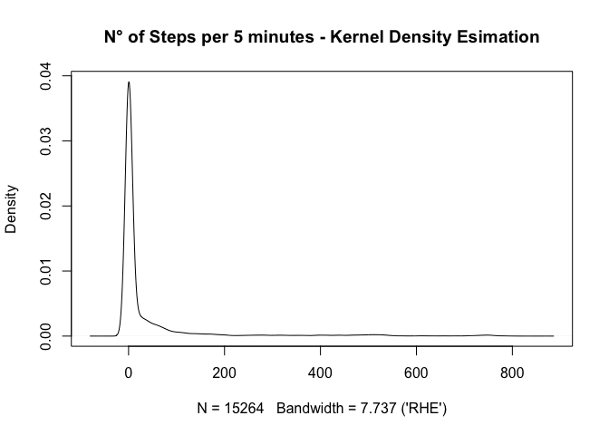
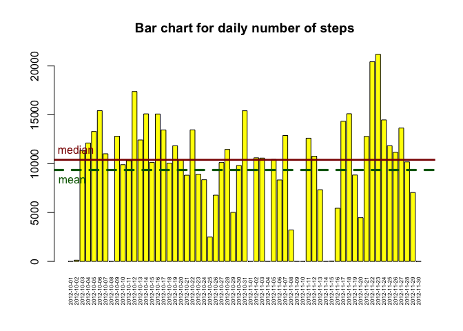
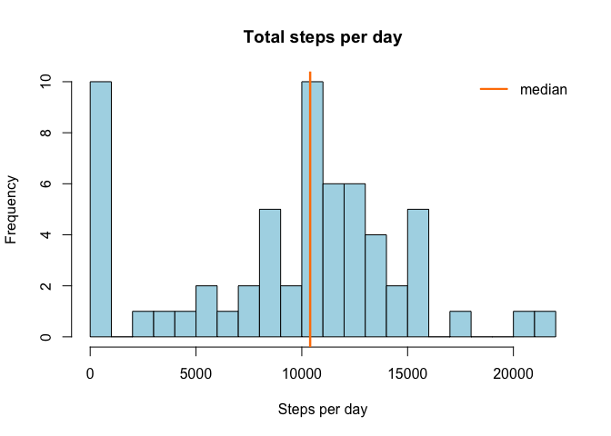
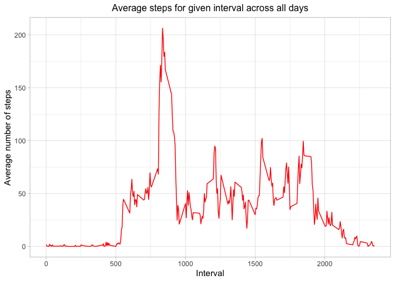
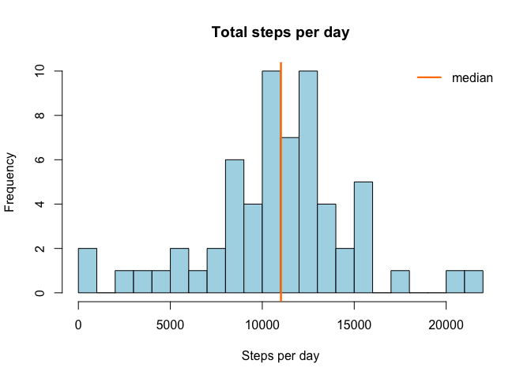
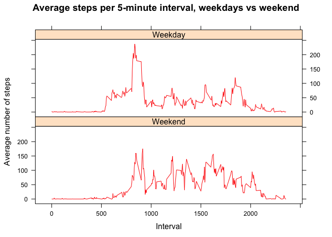

--- 
title: 'Reproducible Research: Peer Assessment 1' 
output: 
  html_document: 
    keep_md: yes 
  pdf_document: default 
--- 

## 1. Loading and preprocessing the data 

After forking the project assignment repository, cloning and linking it to my RStudio, I proceed to read the data. I unzipped it in RStudio itself, so that I only need to use the read.csv() function (since they're comma-separated values). 


```r
rawData <- read.csv("activity.csv", sep = ",") 
```

Let's then take a look at the data structure and characteristics. 


```r
str(rawData) 
```

```
## 'data.frame':	17568 obs. of  3 variables:
##  $ steps   : int  NA NA NA NA NA NA NA NA NA NA ...
##  $ date    : chr  "2012-10-01" "2012-10-01" "2012-10-01" "2012-10-01" ...
##  $ interval: int  0 5 10 15 20 25 30 35 40 45 ...
```

```r
head(rawData, 5) 
```

```
##   steps       date interval
## 1    NA 2012-10-01        0
## 2    NA 2012-10-01        5
## 3    NA 2012-10-01       10
## 4    NA 2012-10-01       15
## 5    NA 2012-10-01       20
```

```r
tail(rawData, 5) 
```

```
##       steps       date interval
## 17564    NA 2012-11-30     2335
## 17565    NA 2012-11-30     2340
## 17566    NA 2012-11-30     2345
## 17567    NA 2012-11-30     2350
## 17568    NA 2012-11-30     2355
```

```r
summary(rawData$steps) 
```

```
##    Min. 1st Qu.  Median    Mean 3rd Qu.    Max.    NA's 
##    0.00    0.00    0.00   37.38   12.00  806.00    2304
```

From str() we see that we have 3 variables (the columns of the dataframe): 'steps' is of class 'integer' and records the number of steps taken in the corresponding 5-minute interval; 'date' is of class 'character' (!), which makes it a string recording the date (YYYY-MM-DD) of the measurement; and finally 'interval' is of class 'integer' and identifies the 5-minute time interval of the measurement. 

The head() and tail() function calls suggest that our data (as we likely would expect in this particular case) are ordered first by date and then by the time interval of the measurement. 

Finally, a customary summary() function call returns some basic descriptive statistics about the number of steps taken. 

It seems reasonable to observe a minimum value of zero: there are (many) 5-minute intervals during the day in which we are seated or otherwise still. 
Moreover, both the 25th percentile and the median are also zero, which suggests that we have a sort of mass point in the distribution of the number of steps at 0, and that our data is censored (n° of steps is non-negative); this fact, together with the maximum (over 800) being relatively large compared to the mean (about 37), which in turns is way greater than the median, suggests that the number of steps per 5-minute interval might be approximately distributed as a Poisson (we are afterall dealing with a count --or a rate, if we consider the number of steps per 5-minute interval--), or possibly a ZIP (Zero-Inflated Poisson) / NB (Negative Binomial). 

Note that, assuming 1 meter per step, our maximum of 800 steps in a 5-minute interval corresponds to about 9.6 km/h. The subject was likely running; still, it's a number that makes sense. This kind of reasoning is useful for preliminary considerations about possible/likely outliers and/or measurement errors in our variables. 

Finally, the summary() call tells us that we have 2,304 missing values (NAs) for the number of steps out of the 17,568 observations, for a net total of 15,264 complete data points.  

While not exactly proper from a formal point of view, we can still eyeball the distribution by plotting the kernel density estimation (often very useful in EDA).  


```r
library(kdensity) 
kdSteps <- kdensity(rawData$steps, start = "gumbel", 
                    kernel = "gaussian", na.rm = TRUE) 
plot(kdSteps, main = "N° of Steps per 5 minutes - Kernel Density Esimation") 
```

<!-- -->

Before proceeding to the next question, since 'date' is a character column, I want to save the data in a separate data frame which I can then freely manipulate. 

For a start, I want to convert the 'date' column in "Date" class, using the 'lubridate' package. 


```r
stepsData <- rawData 
library(lubridate, quietly = TRUE) 
```

```
## 
## Attaching package: 'lubridate'
```

```
## The following objects are masked from 'package:base':
## 
##     date, intersect, setdiff, union
```

```r
stepsData$date <- ymd(stepsData$date) 
class(stepsData$date) 
```

```
## [1] "Date"
```

## What is mean total number of steps taken per day? 

To answer this question, first we need to group our observations by date, and then sum the number of steps for each separate day. A convenient way to do so is to make use of the 'dplyr' package and the powerful 'pipeline operator'. 
I ignore missing values for now (I specify the na.rm = TRUE option so as to avoid including NAs in the sum operation), but I want to keep track of the days in which we observe NAs only --so that the sum is zero-- for later. 


```r
library(dplyr) 
```

```
## 
## Attaching package: 'dplyr'
```

```
## The following objects are masked from 'package:stats':
## 
##     filter, lag
```

```
## The following objects are masked from 'package:base':
## 
##     intersect, setdiff, setequal, union
```

```r
dailyTotal <- stepsData %>% 
              group_by(date) %>% 
              summarise(dailySteps = sum(steps, na.rm = TRUE), 
                        na = mean(is.na(steps))) 
```

The last argument in the summarise() function above creates a variable 'na', which is equal to 1 for observations for which the number of steps is missing (i.e. it is NA), and corresponds to sums of daily steps equal to zero in the new data frame 'dailyTotal', as we can check with: 


```r
identical(which(dailyTotal$dailySteps == 0), which(dailyTotal$na == 1)) 
```

```
## [1] TRUE
```

I also check for congruence between the number of (unique) days in stepsData and the number of "groups" (i.e. days) in the data set just created. 


```r
identical(length(unique(stepsData$date)), nrow(dailyTotal)) 
```

```
## [1] TRUE
```

To see what the mean number of steps taken daily is, ignoring missing values, I just call the mean() function. 


```r
mean(dailyTotal$dailySteps, na.rm = TRUE) 
```

```
## [1] 9354.23
```

## What is the average daily activity pattern? 

A simple way to visualize the average daily activity pattern, in addition to show a summary of the data, is to plot the total number of steps taken each day with a bar chart. For ease of interpretation, I draw two lines, one at the mean and the other at the median level of total steps per day. The resulting barchart suggests that there is some interesting variability in the data. The "gaps" in the bar plot represent days for which data were missing. Notice that the median (10,765) is almost equal to the mean (calculated above). 
Just before this, however, we get some additional information by looking at the "usual suspects" as said. 


```r
summary(dailyTotal$dailySteps) 
```

```
##    Min. 1st Qu.  Median    Mean 3rd Qu.    Max. 
##       0    6778   10395    9354   12811   21194
```

```r
paste0("Inter-quartile range is ", 
       round(IQR(dailyTotal$dailySteps), digits = 2)) 
```

```
## [1] "Inter-quartile range is 6033"
```

```r
paste0("Standard deviation is ", 
       round(sd(dailyTotal$dailySteps), digits = 2)) 
```

```
## [1] "Standard deviation is 5405.9"
```

```r
barplot(height = dailyTotal$dailySteps, names.arg = dailyTotal$date, 
        cex.names = 0.5, las = 3, col = "yellow", 
        main = "Bar chart for daily number of steps") 
abline(h = median(dailyTotal$dailySteps), lty = 1, lwd = 2.75, col = "darkred") 
abline(h = mean(dailyTotal$dailySteps), lty = 2, lwd = 3.2, col = "darkgreen") 
text(x = 1.75, y = median(dailyTotal$dailySteps), 
     pos = 3, labels = "median", col = "darkred") 
text(x = 1, y = mean(dailyTotal$dailySteps), 
     pos = 1, labels = "mean", col = "darkgreen") 
```

<!-- -->

## 2. Histogram of the total number of steps taken each day 


```r
hist(dailyTotal$dailySteps, col = "lightblue", breaks = 20, 
     main = "Total steps per day", xlab = "Steps per day") 
abline(v = median(dailyTotal$dailySteps, na.rm = TRUE), 
       lty = 1, lwd = 2.5, col = "darkorange1") 
legend(legend = "median", "topright", lty = 1, lwd = 2.25, 
       bty = "n", col = "darkorange1") 
```

<!-- -->

Just to get a slightly more complex view, I draw the histogram superimposing a normal pdf (red dashed curve) and a kernel density estimation (green solid line) for comparison (note that y axis is now density instead of frequency). 


```r
kdDailySteps <- kdensity(dailyTotal$dailySteps, start = "gumbel", 
                         kernel = "gaussian", na.rm = TRUE) 
xSeq <- seq(0, max(dailyTotal$dailySteps), length = 20) 
NormalPDF <- dnorm(xSeq, mean = mean(dailyTotal$dailySteps, na.rm = TRUE), 
                   sd = sd(dailyTotal$dailySteps, na.rm = TRUE)) 
hist(dailyTotal$dailySteps, col = "lightblue", breaks = 20, freq = FALSE, 
     main = "Total steps per day", xlab = "Steps per day") 
abline(v = median(dailyTotal$dailySteps, na.rm = TRUE), 
       lty = 1, lwd = 2.5, col = "darkorange1") 
legend(legend = "median", "topright", lty = 1, lwd = 2.25, 
       bty = "n", col = "darkorange1") 
lines(xSeq, NormalPDF, lty = 2, col = "red") 
lines(kdDailySteps, lty = 1, col = "darkgreen") 
```

-1.png)<!-- -->

## 3. Mean and median of the total number of steps taken per day 

The answer is already in the code and output above; however, to make it explicit, I calculate them again here. 


```r
paste0("The mean of the total number of daily steps is ", 
       round(mean(dailyTotal$dailySteps), digits = 2)) 
```

```
## [1] "The mean of the total number of daily steps is 9354.23"
```

```r
paste0("The median of the total number of daily steps is ", 
       round(median(dailyTotal$dailySteps), digits = 2)) 
```

```
## [1] "The median of the total number of daily steps is 10395"
```

## 4. Time series plot of the average number of steps taken 

A time series plot in this case is just a line plot of y (average n. of steps per interval) versus the 5-minute intervals. 

First, however, we need to properly transform the data. 


```r
stepsTS <- stepsData %>% 
           group_by(interval) %>% 
           summarise(average = mean(steps, na.rm = TRUE)) 
```

Here is the time series plot requested. 


```r
library(ggplot2) 
stepsTSplot <- ggplot(stepsTS, aes(x = interval, y = average)) 
stepsTSplot <- stepsTSplot  + 
               geom_line(color = "red") + 
               xlab("Interval") + 
               ylab("Average number of steps") + 
               ggtitle("Average steps for given interval across all days") + 
               theme_light() + 
               theme(plot.title = element_text(size = 12, hjust = 0.5)) 
stepsTSplot 
```

<!-- -->

## 5. The 5-minute interval that on average contains the maximum number of steps 


```r
paste0("The 5-minute interval with the highest n. of steps on average is the ", 
       stepsTS[stepsTS$average == max(stepsTS$average), 1], "th interval.") 
```

```
## [1] "The 5-minute interval with the highest n. of steps on average is the 835th interval."
```

The answer can then be easily compared to the time series plot for congruence. 

## 6. Code & strategy for imputing missing values 

Let's take a look at the number of missing values, and further investigate what percentage of our data they represent. 


```r
missingN <- paste0("There are ", sum(is.na(rawData$steps)), " missing values") 
missingN 
```

```
## [1] "There are 2304 missing values"
```

```r
missingPct <- paste0("Missing values represent ", 
                     round(mean(is.na(rawData$steps)), digits = 4)*100, 
                     "% of the observations") 
missingPct 
```

```
## [1] "Missing values represent 13.11% of the observations"
```

There are different strategies available for imputing missing values, however we are somewhat constrained in this context (with additional variables we could have estimated a regression model and thus imputed the predicted values, for instance). 

One possible approach is to simply impute either the mean or the median. 
Since the latter is zero, as seen before, and the distribution is far from being symmetrical, it would only inflate the number of zeros further. 
On the other hand, the raw (overall) mean is way higher than the median, even higher then the 75th percentile, and as such it might not really be representative. 

One workaround is to impute the interval-weekday pair-specific mean, to partially account for the variability in the data. 
Even though using the mean introduce bias (as any other imputation method, this is always the case), I think it is the most viable approach for the current issue^[More accurately, it is appropriate for this simple project. The methods and drawbacks of single value imputation, such as mean imputation, as well as available alternatives, are described in Little & Rubin (2019 3rd ed.), _Statistical Analysis with Missing Data_.]. 

To recap: let's first create a new variable which assigns the proper day of the week to each date, then group the data by 5-minute interval and weekday, compute the interval-weekday mean, and finally assign it to the corresponding observations with missing values. 

The dplyr package allows to perform all of the above compactly, together with the vectorized ifelse() function. 


```r
naImputing <- stepsData %>% 
            mutate(weekday = wday(rawData$date, label = TRUE)) %>% 
            group_by(interval, weekday) %>% 
            mutate(steps = ifelse(is.na(steps), mean(steps, na.rm=TRUE), steps)) 
```

A simple summary() call shows that this method of imputation, in this particular application, does not seem to have changed the distribution too much: we observe but a somewhat considerable increase in the 75th quantile, from 12 to 19. 


```r
summary(naImputing$steps) 
```

```
##    Min. 1st Qu.  Median    Mean 3rd Qu.    Max. 
##    0.00    0.00    0.00   37.57   19.04  806.00
```

## 7. Histogram of the total number of steps taken each day after missing values are imputed 

This part is analogous to point 2 above: we group our data (which now have missing values imputed) and we draw the resulting histogram, both with frequency and density as y-axis. The corresponding kernel density estimated distribution (green) and normal pdf (red) are superimposed on the latter. 


```r
dailyTotalNA <- naImputing %>% 
              group_by(date) %>% 
              summarise(dailySteps = sum(steps, na.rm = TRUE)) 
```


```r
hist(dailyTotalNA$dailySteps, col = "lightblue", breaks = 20, 
     main = "Total steps per day", xlab = "Steps per day") 
abline(v = median(dailyTotalNA$dailySteps, na.rm = TRUE), 
       lty = 1, lwd = 2.5, col = "darkorange1") 
legend(legend = "median", "topright", lty = 1, lwd = 2.25, 
       bty = "n", col = "darkorange1") 
```

<!-- -->


```r
kdDailyStepsNA <- kdensity(dailyTotalNA$dailySteps, start = "gumbel", 
                           kernel = "gaussian", na.rm = TRUE) 
xSeqNA <- seq(min(dailyTotalNA$dailySteps), max(dailyTotalNA$dailySteps), 
              length = 20) 
NormalPDFna <- dnorm(xSeqNA, mean = mean(dailyTotalNA$dailySteps, na.rm = TRUE), 
                     sd = sd(dailyTotalNA$dailySteps, na.rm = TRUE)) 
hist(dailyTotalNA$dailySteps, col = "lightblue", breaks = 20, freq = FALSE, 
     main = "Total steps per day", xlab = "Steps per day") 
abline(v = median(dailyTotalNA$dailySteps, na.rm = TRUE), 
       lty = 1, lwd = 2.5, col = "darkorange1") 
legend(legend = "median", "topright", lty = 1, lwd = 2.25, 
       bty = "n", col = "darkorange1") 
lines(xSeqNA, NormalPDFna, lty = 2, col = "red") 
lines(kdDailyStepsNA, lty = 1, col = "darkgreen") 
```

-1.png)<!-- -->

## Are there differences in activity patterns between weekdays and weekends? 

First, from the data set with imputed NAs, I first create a weekday variable as before, then I use it to create a 'TypeDay' variable^[Please do note that I am working with R localized in Italian, which means that "Sab", shorthand for "Sabato", is Saturday, and "Dom" (Domenica) is Sunday], which I then make sure to convert in 'factor' class.   


```r
dayCatTS <- naImputing %>% 
            mutate(TypeDay = ifelse(weekday %in% c("Sab", "Dom"), 
                                    "Weekend", "Weekday")) %>% 
            mutate(TypeDay = as.factor(TypeDay)) %>% 
            group_by(interval, TypeDay) %>% 
            summarise(average = mean(steps, na.rm = TRUE)) 
```

```
## `summarise()` has grouped output by 'interval'. You can override using the `.groups` argument.
```

## 8. Panel plot comparing the average number of steps taken per 5-minute interval across weekdays and weekends 

We now want to extend the analysis performed in point 4 by comparing weekdays interval averages to weekend interval averages. 

Since the 'lattice' package is well-suited to generate panel plots and is often chosen for exactly this reason, let's use that. 


```r
library(lattice) 
xyplot(average ~ interval | TypeDay, data = dayCatTS, 
       type = "l", col = "red",  layout = c(1,2), 
       main = "Average steps per 5-minute interval, weekdays vs weekend", 
       ylab = "Average number of steps", xlab = "Interval") 
```

<!-- -->

The two 'time series' plots suggest that weekdays and weekends do indeed differ quite substantially in the daily activity pattern; while we observe but one peak for work days around the max (recall we calculated it to be the 835th interval, overall), weekends show more variability and a higher average level overall, which suggests that further inquiry might be promising. 


